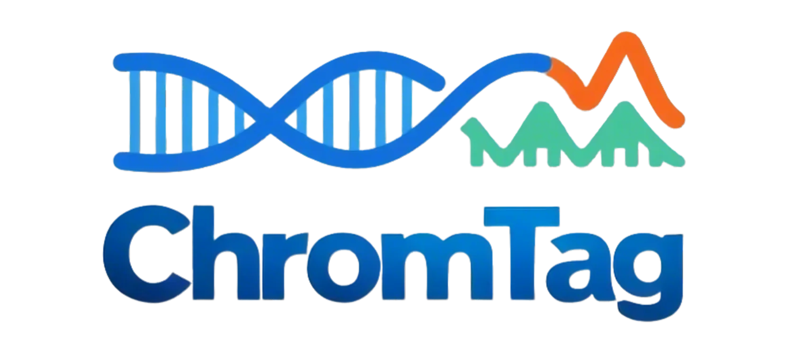
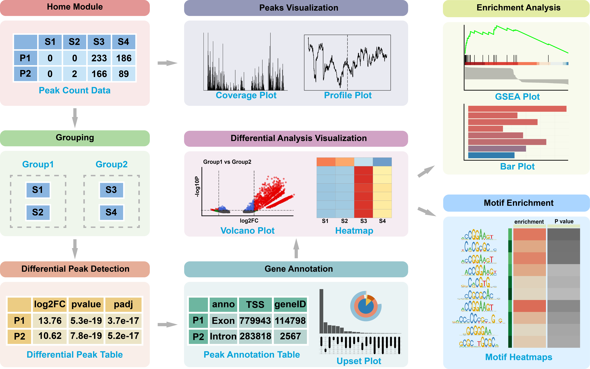

<div style="position: fixed; top: 10px; left: 0px; z-index: 1000;">
    <!-- 设置合适的宽度来缩小 -->
</div>
ChromTag is an open-source, interactive R Shiny application for analyzing and visualizing CUT&Tag and other epigenomic profiling datasets. It provides an end-to-end workflow—including peak visualization, filtering, differential peak analysis, gene annotation, enrichment analysis, and motif discovery—allowing users to explore chromatin regulatory landscapes with just a few clicks. With support for human, mouse, and Drosophila datasets, ChromTag offers publication-ready visualizations and an intuitive interface, making it an accessible and comprehensive tool for epigenomic research.<br><br>


<div align="center">
  
</div>
The Shiny application is additionally hosted at https://xulabgdpu.cpolar.top/ChromTag.

## Local Installation (Optional)

### 1. Download Linkage Source Code
You can obtain the source code in either of the following ways:
  + Clone the GitHub repository:
    ```bash
    git clone https://github.com/fluquor1214/ChromTag.git
    ```
    Or

   + Download the ZIP file from: [https://github.com/fluquor1214/ChromTag](https://github.com/fluquor1214/ChromTag).  
   The downloaded folder should be named ChromTag.


   
  
### 2. Install Required R Packages & Run ChromTag
+ **Manual Package Installation**    
1.Open your R or RStudio environment.  
2.Install the required packages:  
    ```r
    install.packages(c(
  "shiny",
  "shinydashboard",
  "shinyWidgets",
  "shinycssloaders",
  "shinyjs",
  "shinyBS",
  "DT",
  "tidyverse",
  "ggplot2",
  "ggrepel",
  "dplyr",
  "pheatmap",
  "grid",
  "colourpicker",
  "digest",
  "shinyFeedback",
  "shinydashboardPlus"))
    
    if (!requireNamespace("BiocManager", quietly = TRUE))
        install.packages("BiocManager")  

    BiocManager::install(c(
  "DESeq2",
  "GenomicRanges",
  "ChIPseeker",
  "TxDb.Hsapiens.UCSC.hg38.knownGene",
  "TxDb.Hsapiens.UCSC.hg19.knownGene",
  "TxDb.Mmusculus.UCSC.mm10.knownGene",
  "TxDb.Dmelanogaster.UCSC.dm6.ensGene",
  "GenomicFeatures",
  "org.Mm.eg.db",
  "org.Hs.eg.db",
  "org.Dm.eg.db",
  "EnhancedVolcano",
  "clusterProfiler",
  "BSgenome.Hsapiens.UCSC.hg38",
  "BSgenome.Mmusculus.UCSC.mm10",
  "BSgenome.Dmelanogaster.UCSC.dm6",
  "rtracklayer",
  "TFBSTools",
  "enrichplot",
  "monaLisa",
  "JASPAR2020"))
    ```    
    ℹ️ A complete list of packages and versions can be found in the [sessionInfo](https://github.com/fluquor1214/ChromTag/blob/main/sessionInfo.txt) file.  

### 3.Run the application from the directory:
  ```r
  shiny::runApp("/path/to/ChromTag")
  ```
   
## Authors
Please do not hesitate to post an issue or contact the authors :

Siwen Xu: siwxu@gdpu.edu.cn

Qingyan Zou: 1040624480@qq.com
