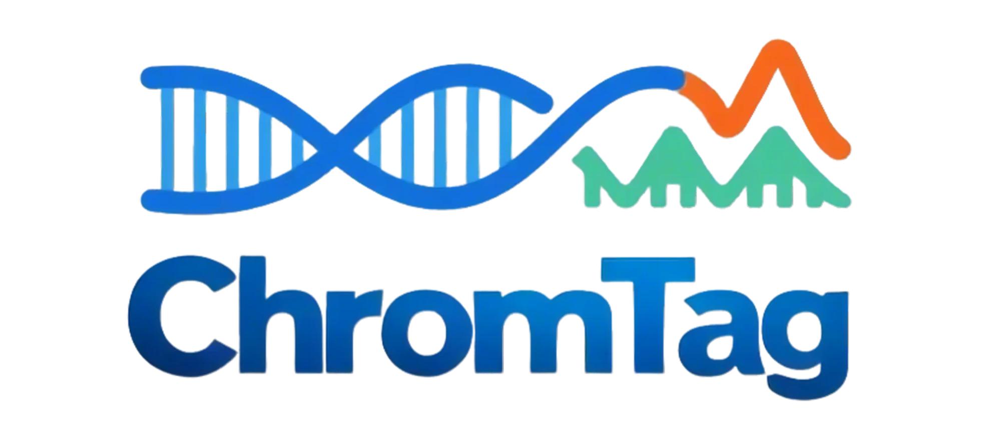

    <!-- 设置合适的宽度来缩小 -->

ChromTag is a user-friendly, interactive, and open-source R-Shiny application for the analysis and visualization of CUT&amp;Tag and ChIP-seq data . It streamlines data processing, from peak visualization and filtering to differential peak detection , gene annotation, and enrichment analysis. Users can upload a pre-merged peak count matrix and explore various analysis modules with just a few clicks. The application offers multiple visualization tools, including chromosome coverage plots, heatmaps, and volcano plots, making data interpretation more intuitive. Additionally, motif enrichment analysis helps identify potential regulatory elements linked to differentially enriched peaks . ChromTag provides a comprehensive and accessible solution for researchers studying chromatin modifications and transcriptional regulation.

  

The Shiny application is additionally hosted at https://xulabgdpu.cpolar.top/ChromTag.
